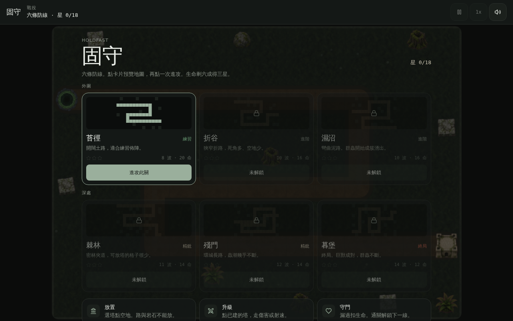
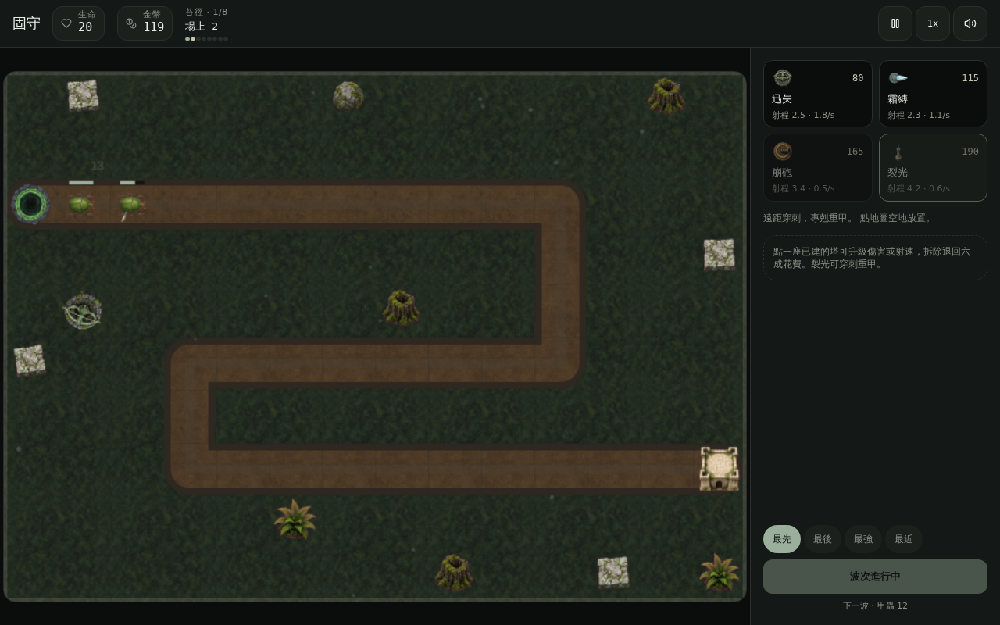

# Holdfast · 固守

**繁體中文** | [English](README.en.md)

瀏覽器塔防遊戲：在苔石防線上放置防禦塔，擋住一波波襲來的甲蟲軍團。通關解鎖下一線，生命比例決定星等。



## 遊戲特色

- 六條關卡，外圍三線、深處三線，路線與調色各自不同
- 四種防禦塔：連射、降速、濺射、穿刺重甲
- 五種敵人：甲蟲、疾足、重甲、巨獸、群蟲
- 傷害與射速兩條升級，拆除退回六成花費
- 可切換鎖定優先：最先、最後、最強、最近
- 星等與解鎖進度存在本機 `localStorage`，不需登入

## 戰役

| 章節 | 關卡 | 難度 | 波次 | 生命 |
| --- | --- | --- | --- | --- |
| 外圍 | 苔徑 | 練習 | 8 | 20 |
| 外圍 | 折谷 | 進階 | 10 | 16 |
| 外圍 | 濕沼 | 進階 | 10 | 16 |
| 深處 | 棘林 | 精銳 | 11 | 14 |
| 深處 | 殘門 | 精銳 | 12 | 14 |
| 深處 | 暮堡 | 終局 | 14 | 12 |

生命剩六成得三星、三成得兩星，其餘一星。通關才解鎖下一關。



## 防禦塔

| 塔 | 花費 | 定位 |
| --- | --- | --- |
| 迅矢 | 80 | 廉價連射，單點清線 |
| 霜縛 | 115 | 降速控場，拖住突襲 |
| 崩砲 | 165 | 慢速濺射，專門打堆 |
| 裂光 | 190 | 遠距穿刺，專剋重甲 |

## 操作

| 輸入 | 動作 |
| --- | --- |
| 點卡片 | 預覽地圖；再點一次進攻 |
| Enter | 進攻目前關卡／通關後下一關 |
| 1–4 | 選迅矢、霜縛、崩砲、裂光 |
| 空白鍵 | 提前放波（有金幣獎勵） |
| Esc / P | 暫停或返回關卡 |
| 點地圖空地 | 放置所選的塔 |
| 點已建的塔 | 升級傷害或射速、拆除 |

路與岩石不能放塔。金幣不夠時射程圈會變紅。

## 技術棧

- React 19、TanStack Start、Tailwind CSS v4
- Canvas 2D 遊戲迴圈，固定 `1/60` 物理步進
- Zustand 同步 HUD
- 無帳號、無資料庫；進度只寫入瀏覽器

```text
src/
  game/            引擎、關卡、渲染、精靈、進度
  components/game/ 畫布、HUD、塔塢、戰役／勝負 overlay
  routes/          頁面入口
public/
  sprites/         塔、敵人、投射物、場景道具
  tiles/           地面與土路貼圖
```

## 本機執行

需要 [Node.js 22](https://nodejs.org/)。

```bash
git clone https://github.com/richie7p/zinc-wind-tundra-stone.git
cd zinc-wind-tundra-stone
npm install
npm run dev
```

瀏覽器開啟提示的本機網址即可遊玩。

```bash
npm run typecheck   # TypeScript
npm run build       # 正式建置
```

本專案不需 API Key、資料庫或登入。

## 授權

未附加授權條款。若要公開轉用，請先與倉庫擁有者確認。
